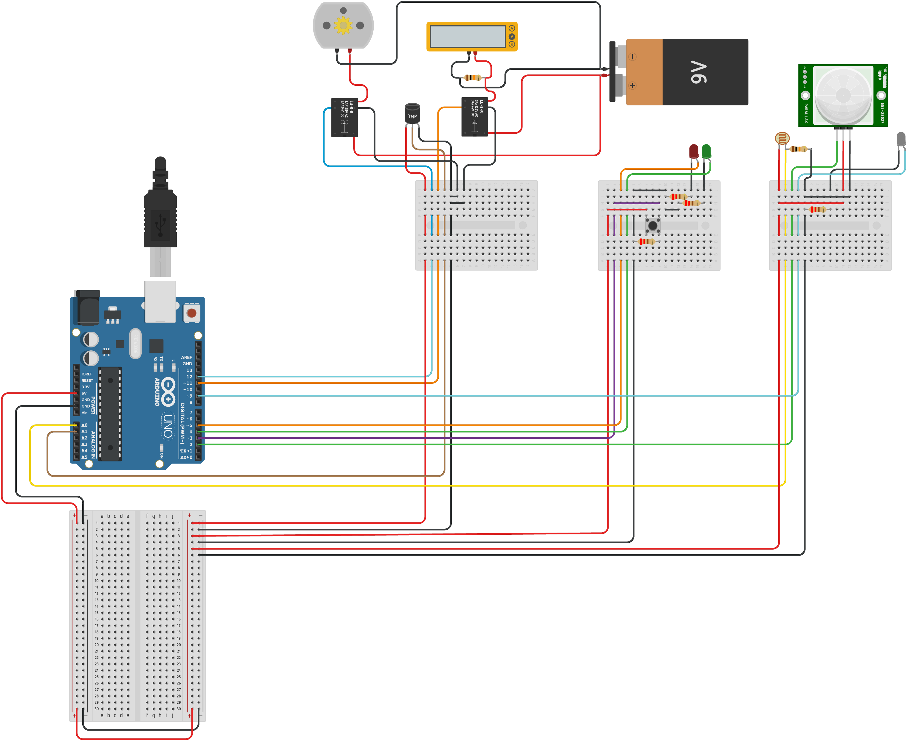

<h1 align="center">Smart Home System</h1>

"Smart Home System" is a final exam project for the "Internet of Things" course at Singidunum University. The course was designed to teach students about Smart Home appliances, how they work and real world applications. To combine all the knowledge we learned during the course, we were tasked to create a smart home system that consists of an Arduino microcontroller with a couple of different sensors and actuators, and a python script that reports read data to ThingSpeak and allows for remote control using email.

## 💡 Features

The project had the following features:

- Temperature regulation system
- Automatic light control
- Home security system
- Emergency mode
- Remote control through email
- Data reporting and visualization

## 🧰 Languages & Tools

<a href="https://code.visualstudio.com/"></a>
<a href="https://www.arduino.cc/"></a>
<a href="https://www.python.org/"></a>

## ⚡ Getting Started

### 🛠 Requirements:

#### Hardware:

- Arduino Uno Rev3
- LM35 Temperature sensor
- 2x SPST/SPDT relay
- PIR sensor
- 1x Photo-resistor
- 1x Red LED diode
- 1x Green LED diode
- 1x White LED diode
- 4x 220Ohm resistors
- 1x 10kOhm resistor
- 1x Heater
- 1x Fan/DC Motor
- 1x Pushbutton

#### Software

- [Python](https://www.python.org/downloads/)

### 📖 Guide:

1. Follow the schematic below to connect your components:
    
2. Download the repository
3. Flash the code onto the Arduino
4. Execute the following command to install all the necessary libraries:
   ```
   > pip install requests pyserial numpy matplotlib apscheduler python-dotenv
   ```
5. Create a `.env` file based on `template.env`
6. Plug in the arduino and run ```Backend.py```
7. Enjoy 🙂

## ⚖ License
This repository is not under any license. Normal copyright laws apply!